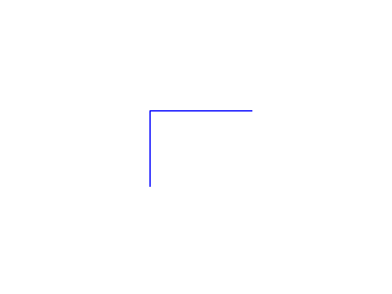
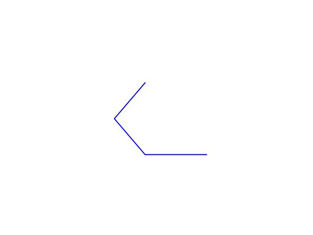

Fractals
========
creates fractal gifs using the L system

see examples in the `examples/` folder

Installation
-------------

`pip install pyfractals`

currently supported fractals:
-----------------------------
- Dragon Curve

- Sierpinski Triangle

- C Curve

usage
-----

    $ python3 pyfractals/fractals.py <name>

name is either dragon_curve or sierpinski or ccurve

this command will create a few temporary png images
and then create a gif from them

example
--------

    $ python3 fractals.py dragon_curve
